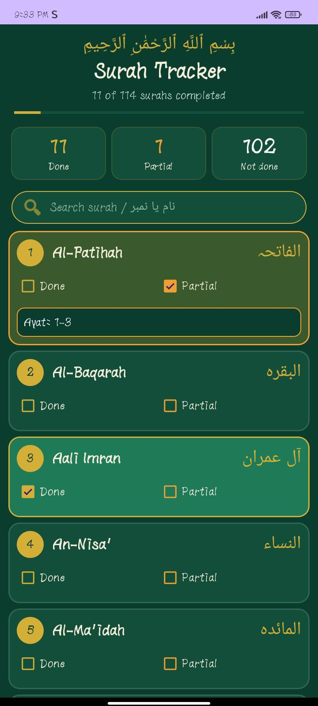
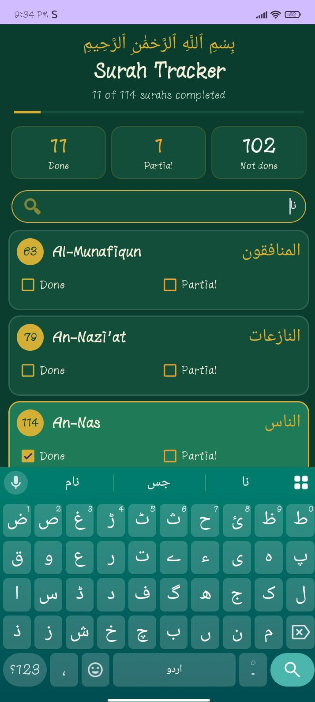
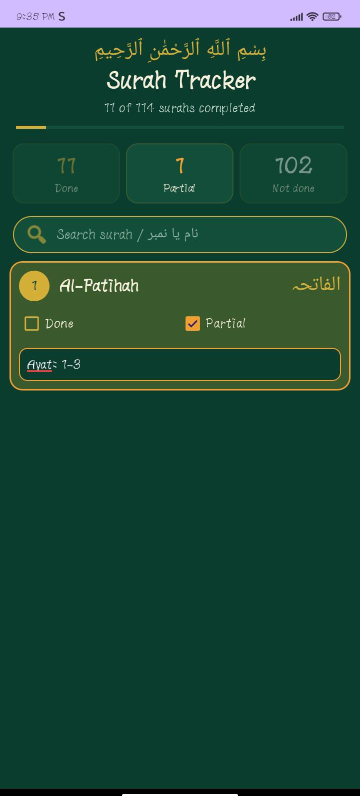

# Surah Tracker

A lightweight, offline Android app for tracking your Quran progress across all 114 surahs.

Mark each surah as **Done** or **Partial**, note exactly how much you have completed (for example "Ayat 1-50" or "2 Rukus"), and see at a glance how many surahs are done, partial, and still remaining.

## Screenshots

<table>
  <tr>
    <td align="center"> Main list with progress</td>
    <td align="center"> Search by name or number</td>
    <td align="center"> Filtered by Partial</td>
  </tr>
</table>

## Features

- All 114 surahs listed with English and Urdu names
- **Done** and **Partial** checkboxes for every surah
- A text box for partial surahs to record the ayat or rukus completed
- Progress bar with live counters for Done, Partial, and Not done
- Tap a counter to filter the list by status
- Search by English name, Urdu name, or surah number
- Progress is saved automatically on the device and is still there when you reopen the app
- Green and gold theme; no internet, accounts, or ads

## Tech

- Kotlin with XML layouts
- RecyclerView and Material Components
- Data stored locally with SharedPreferences
- Minimum Android version: 7.0 (API 24)

## Build and run

1. Clone the repository and open it in Android Studio.
2. Let Gradle sync finish.
3. Connect an Android phone with USB debugging enabled, or start an emulator.
4. Press **Run**.

## Note

Progress is stored only on your device. Uninstalling the app or clearing its data erases it.

Built for personal use.
